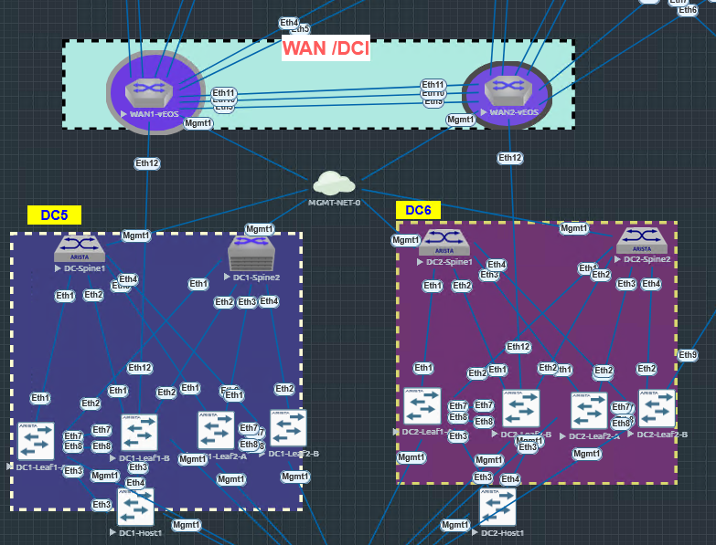

# SID L3LS EVPN Multi-Site AVD Lab

This repository contains a working Arista AVD lab for two L3 leaf-spine data centers with EVPN/VXLAN, MLAG, VLAN/VRF services, and a WAN/DCI path through two BR-WAN routers.

The current design has been built, deployed, corrected after reboot testing, and verified live.

## VS Code Work Summary

This repo was finalized from VS Code by updating the AVD YAML source of truth, adding WAN/DCI and EVPN gateway intent, fixing MLAG/BGP reboot behavior, generating BR-WAN configs from Python/YAML, and publishing a sanitized GitHub-ready version.

## Lab Summary

| Area | Status | Notes |
| --- | --- | --- |
| Site 1 fabric | Working | `s1-spine1/2`, `s1-leaf1/2/3/4` |
| Site 2 fabric | Working | `s2-spine1/2`, `s2-leaf1/2/3/4` |
| MLAG | Working | Uses `Port-Channel7`, `Ethernet7/8`, VLANs `4093/4094`, MTU `1500` |
| EVPN/VXLAN | Working | Overlay uses Loopback0/Loopback1 with AVD-generated EVPN config |
| WAN/DCI | Working | `s1-leaf2 <-> BR-WAN1 <-> BR-WAN2 <-> s2-leaf2` |
| EVPN gateway | Working | Inter-site EVPN peering between `s1-leaf2` and `s2-leaf2` |
| Startup persistence | Working | Corrected configs saved after verification |

## Topology



```text
Site 1 Fabric                         WAN/DCI                         Site 2 Fabric

s1-spine1   s1-spine2                                             s2-spine1   s2-spine2
    |           |                                                     |           |
    +----- s1-leaf2 ----- Ethernet12 ----- BR-WAN1 ----- BR-WAN2 ----- Ethernet12 ----- s2-leaf2
          /       \                                                                    /       \
    s1-leaf1     MLAG                                                           MLAG     s2-leaf1

EVPN gateway peer:
  s1-leaf2 Loopback0 10.250.1.4  <---- WAN routed underlay ---->  s2-leaf2 Loopback0 10.250.2.4
```

## Important IP Plan

| Function | Site 1 | Site 2 |
| --- | --- | --- |
| Spine AS | `65100` | `65200` |
| Rack 1 leaf AS | `65101` | `65201` |
| Rack 2 leaf AS | `65102` | `65202` |
| Leaf router-id pool | `10.250.1.0/24` | `10.250.2.0/24` |
| VTEP loopback pool | `10.255.1.0/24` | `10.255.2.0/24` |
| MLAG peer VLAN pool | `10.251.1.0/24` | `10.251.2.0/24` |
| MLAG L3 VLAN pool | `10.252.1.0/24` | `10.252.2.0/24` |
| Underlay uplinks | `172.16.1.0/24` | `172.16.2.0/24` |
| WAN/DCI links | `172.16.255.0/24` | `172.16.255.0/24` |

## Key Files

| File | Purpose |
| --- | --- |
| `global_vars/global_dc_vars.yml` | Global AVD connection, fabric, BFD, and WAN/DCI L3 edge settings |
| `sites/site_1/group_vars/SITE1_FABRIC.yml` | Site 1 spine/leaf topology, MLAG, EVPN gateway peer |
| `sites/site_2/group_vars/SITE2_FABRIC.yml` | Site 2 spine/leaf topology, MLAG, EVPN gateway peer |
| `sites/site_1/group_vars/SITE1_NETWORK_SERVICES.yml` | Site 1 VLAN/VRF services |
| `sites/site_2/group_vars/SITE2_NETWORK_SERVICES.yml` | Site 2 VLAN/VRF services |
| `sites/site_1/group_vars/SITE1_CONNECTED_ENDPOINTS.yml` | Site 1 host/MLAG endpoint ports |
| `sites/site_2/group_vars/SITE2_CONNECTED_ENDPOINTS.yml` | Site 2 host/MLAG endpoint ports |
| `extra_configs/wan_vars.yml` | Source data for BR-WAN router config generation |
| `scripts/build_wan.py` | Generates `BR-WAN1.cfg` and `BR-WAN2.cfg` from YAML |
| `playbooks/validate.yml` | Runs ANTA validation through AVD `anta_runner` |
| `sites/*/intended/configs/` | AVD-generated EOS configs for review before deploy, regenerated locally |
| `sites/*/documentation/` | AVD-generated fabric and device documentation, regenerated locally |
| `sites/*/anta/` | ANTA catalogs and reports, regenerated locally |

## What Was Fixed

### MLAG Stability

The lab uses:

- `Port-Channel7` for MLAG peer-link
- `Ethernet7` and `Ethernet8` as MLAG member links
- VLAN `4094` for MLAG control
- VLAN `4093` for MLAG L3 peering
- MTU `1500` on MLAG VLAN SVIs and routed uplinks
- `no autostate` on VLAN `4094`

This matches the stable working model used during testing.

### WAN/DCI and EVPN Gateway

The WAN/DCI underlay is modeled in AVD with `l3_edge`:

- `s1-leaf2 Ethernet12` to `BR-WAN1 Ethernet12`
- `s2-leaf2 Ethernet12` to `BR-WAN2 Ethernet12`
- WAN link pool: `172.16.255.0/24`
- Leaf-to-WAN BGP:
  - `s1-leaf2` AS `65101` to `BR-WAN1` AS `65401`
  - `s2-leaf2` AS `65201` to `BR-WAN2` AS `65402`

EVPN gateway is enabled for the Rack 1 MLAG pairs, with the actual remote gateway peer only on the WAN-connected leafs:

- `s1-leaf2` peers to `s2-leaf2` at `10.250.2.4`
- `s2-leaf2` peers to `s1-leaf2` at `10.250.1.4`

### BGP Password Issue After Reboot

After reboot, `s1-leaf2` and `s2-leaf2` had BGP stuck in `Connect` to their local spines and MLAG L3 peer. Interfaces and pings were good, but TCP stayed in `SYN-SENT`.

Root cause:

```text
BGP MD5 authentication was enabled on the rebuilt leaf2 peer-groups,
but the existing spines and peer leafs were running without MD5.
```

Fix:

- Removed global AVD BGP peer-group passwords from `global_dc_vars.yml`
- Removed no-longer-needed WAN password exceptions from the site fabric YAML
- Rebuilt both sites
- Removed stale BGP peer-group passwords from `s1-leaf2` and `s2-leaf2`
- Saved startup config on both devices

## Build Workflow

Run commands from this directory:

```bash
cd labs/L3LS_EVPN
```

Set local lab credentials before building or deploying:

```bash
export ANSIBLE_USER="admin"
export ANSIBLE_PASSWORD="<your-lab-password>"
export LAB_ADMIN_USER="admin"
export LAB_ADMIN_SHA512="<sha512-password-hash>"
export LAB_ADMIN_SSH_KEY="$(cat ~/.ssh/id_rsa.pub)"
```

Build Site 1:

```bash
make build-site-1
```

Build Site 2:

```bash
make build-site-2
```

Build WAN router configs:

```bash
make build-wan
```

Review intended configs before deploying:

```bash
less sites/site_1/intended/configs/s1-leaf2.cfg
less sites/site_2/intended/configs/s2-leaf2.cfg
less extra_configs/BR-WAN1.cfg
less extra_configs/BR-WAN2.cfg
```

## Deploy Workflow

Deploy Site 1:

```bash
make deploy-site-1
```

Deploy Site 2:

```bash
make deploy-site-2
```

Deploy or update WAN routers:

```bash
make preplab
```

If eAPI has TLS issues against BR-WAN routers, use SSH/network_cli with the same generated configs.

## Validation Commands

ANTA is integrated through the AVD `arista.avd.anta_runner` role. Build the site first so structured configs exist, then run validation.

The committed validation summary is here:

```text
docs/anta-validation-summary.md
```

Generate ANTA catalogs without touching devices:

```bash
make anta-dry-run-site-1
make anta-dry-run-site-2
```

Run ANTA against each site:

```bash
make validate-site-1
make validate-site-2
```

Run both sites:

```bash
make validate-all
```

ANTA outputs are written locally under:

```text
sites/site_1/anta/reports/
sites/site_2/anta/reports/
```

The report folders are ignored in Git because they are generated artifacts and may include local runtime details.

Check MLAG:

```bash
ansible s1-leaf1,s1-leaf2,s2-leaf1,s2-leaf2 \
  -i sites/site_1/inventory.yml -i sites/site_2/inventory.yml \
  -m arista.eos.eos_command \
  -a 'commands="show mlag,show ip interface brief"'
```

Check BGP and EVPN:

```bash
ansible s1-leaf2,s2-leaf2 \
  -i sites/site_1/inventory.yml -i sites/site_2/inventory.yml \
  -m arista.eos.eos_command \
  -a 'commands="show ip bgp summary,show bgp evpn summary"'
```

Expected healthy state:

- Spine underlay neighbors are `Established`
- MLAG L3 peer is `Established`
- BR-WAN neighbor is `Established`
- EVPN gateway peer is `Established`

## Current Verified State

The latest live verification showed:

| Device | Neighbor Type | Result |
| --- | --- | --- |
| `s1-leaf2` | Site 1 spines | `Established` |
| `s1-leaf2` | `s1-leaf1` MLAG L3 peer | `Established` |
| `s1-leaf2` | `BR-WAN1` | `Established` |
| `s1-leaf2` | `s2-leaf2` EVPN gateway | `Established` |
| `s2-leaf2` | Site 2 spines | `Established` |
| `s2-leaf2` | `s2-leaf1` MLAG L3 peer | `Established` |
| `s2-leaf2` | `BR-WAN2` | `Established` |
| `s2-leaf2` | `s1-leaf2` EVPN gateway | `Established` |

## Git Push Steps

This lab repo is intended to be pushed to:

```text
https://github.com/sidibrao/sid-ci-workshops-avd-rr0.2.git
```

Recommended push flow:

```bash
cd labs/L3LS_EVPN
git remote set-url origin https://github.com/sidibrao/sid-ci-workshops-avd-rr0.2.git
git status
git add .
git commit -m "Finalize L3LS EVPN multi-site AVD lab"
git push -u origin main
```

If the GitHub repo already has unrelated history and you intentionally want this lab to replace it:

```bash
git push -u origin main --force-with-lease
```

Use force push only when you are sure this repository should become the source of truth.

## Operator Notes

- Save files in VS Code before running AVD builds.
- Review `sites/*/intended/configs/*.cfg` before deploy.
- Generated intended configs, device docs, ANTA reports, and deployment backups are intentionally ignored in Git because they can contain local credential material. Regenerate them locally as needed.
- Keep BGP peer-group passwords disabled unless all corresponding neighbors are configured with matching MD5.
- Keep Site 1 and Site 2 pools unique to avoid duplicate router IDs, MLAG identities, and VTEP addressing.
- Keep the anycast gateway MAC consistent across sites when stretching VLANs intentionally.
